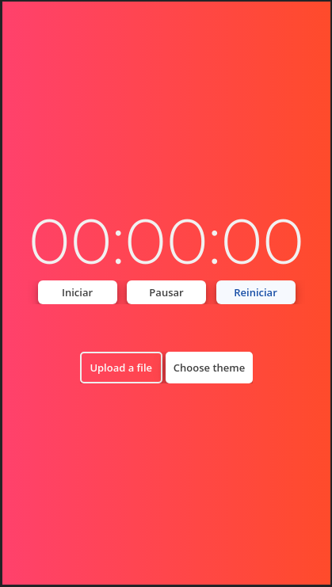
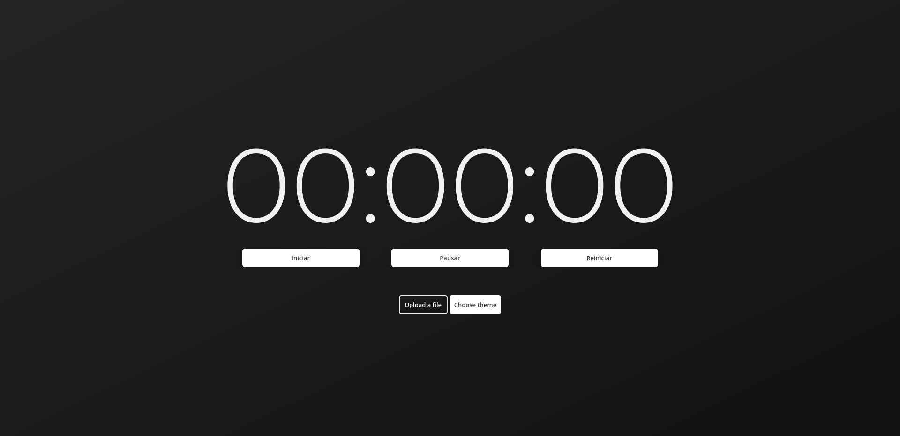
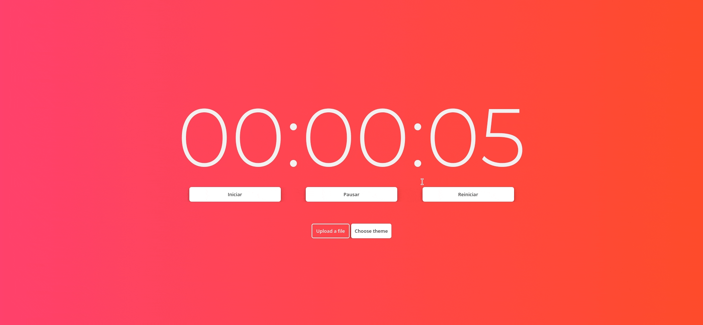
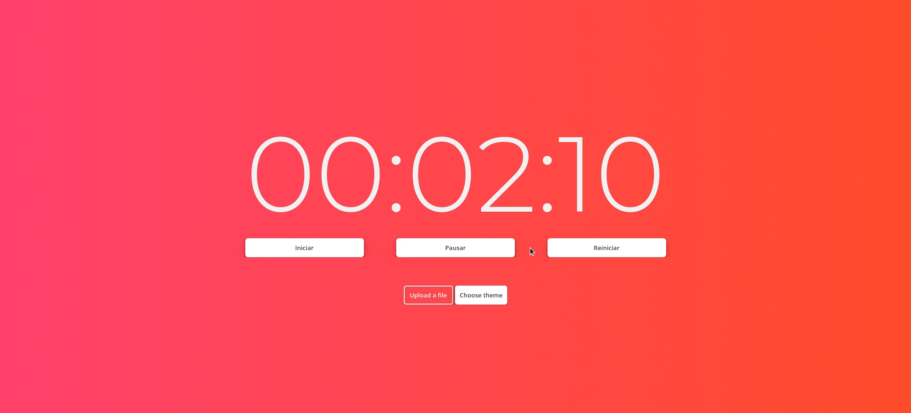
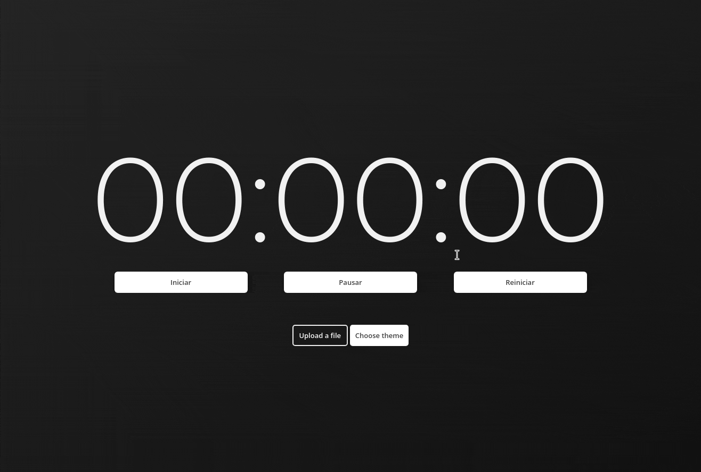
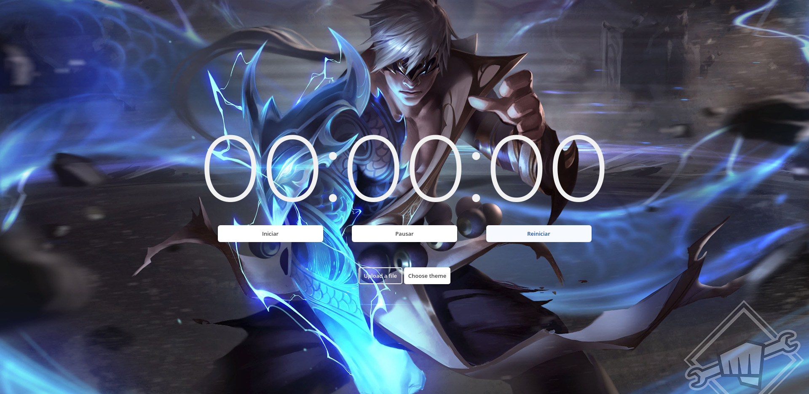
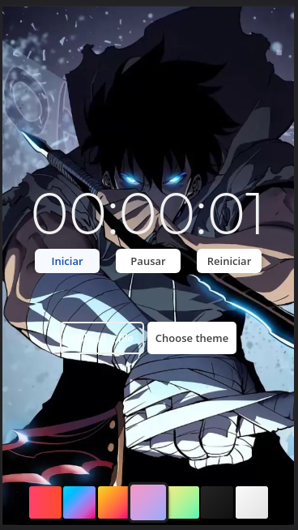

# Cronometro JS

Um cronometro simples com funções para mudança de tema, salvamento do tempo no navegador e upload de imagens para background

## Tela Inicial Web

## Tela Inicial Mobile

O site está hospedado na vercel e githubpages você pode acessa-lo por este link https://cronometro-eight.vercel.app/

## Stack utilizada

**Front-end:** Vanilla Javascript, Css e HTML5

**Misc:** Gulp, Babel, ESlint e Conventional Commits

## Aprendizados

- Busquei ter total atenção a tags semânticas
- Boas práticas de código
- Uso do Local Storage para salvar temas e tempo
- Componetização CSS
- Upload de imagem
- Setimeout para a funcionalidade do cronometro
- Babel e Gulp para minificar, concaternar e habilitar javascript moderno em browser antigos
- ESlint para manter um padrão de código
- Conventional Commits para facilitar a leitura de commits

## Como usar

Em sua primeira visita ao site o tema padrão será o Dark

Para iniciar o cronometro você pode clicar no botão iniciar normalmente

Ao iniciar o tempo já é registrado assim podendo atualizar a página ou muda-la e o tempo estará salvo.

## Pausar e Despausar

Ao pausar o botão muda para mostrar que está em pause.

## Reiniciar

Além de reiniciar o cronometro o botão reiniciar também atualiza as informações de tempo salvas e ao atualizar a página o tempo mostrado será 00:00:00

## Mudanças de temas

Você pode fazer a mudança clicando no botão Choose Theme

As escolhas ficam salvas para uma proxima visita ao site

## Upload de imagens

O botão upload permite usar uma imagem de sua galeria como fundo

Na versão mobile a camera também pode ser usada para escolha do fundo

## Funcionalidades

- Temas dark, light e outros 5 temas degrade
- Possui responsividade em desktop,tablet ou mobile.
- Salva o tema escolhido
- Upload de imagens para background
- Salva o tempo registrado no cronômetro

### Proximas features ou melhorias

- Refatoração de código
- Acessibilidade : Opção uso do Cronometro por meio do teclado apenas
- Animações : Mudanças de temas com mais flúidez
- Reset : Botão para apagar informações salvas como tempo e tema escolhido
- UI : Adição de icones na versão mobile
- Opção de Cadastrar usuário para salvar informações de tema e tempos
- Função Pomodoro
